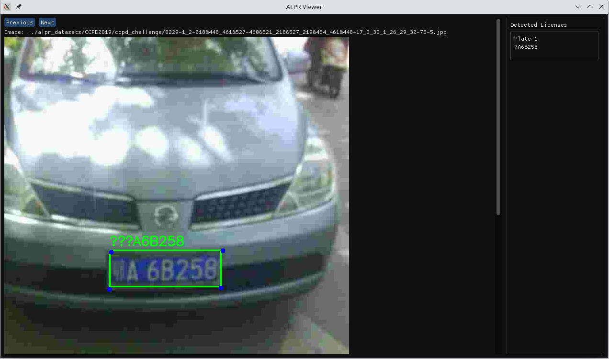

### Automatic License Plate Recognition (ALPR)

A lightweight, efficient, and modern approach to License Plate Detection and Recognition, designed with state-of-the-art performance in mind.




## Goals

1. Minimal dependencies and requirements
2. Compatible with latest PyTorch versions
3. Should run *fast* on CPU
4. Easy to train

## Architecture

It is composed of two networks:

1. Detection: heavily inspired on [SCRFD](https://arxiv.org/abs/2105.04714). Changed the backbone and neck, however the main ideas remains. Uses Integral regression from [TinaFace](https://arxiv.org/abs/2011.13183) for plate bounding box. It is just a tidy slower but more accurate. The plate corners with a simple regression head proposed on SCRFD.
2. OCR: Implements [MaskOCR](https://arxiv.org/abs/2206.00311) for plate text recognition. It is one of the state of the art OCRs with a really good CPU performance.


The pipeline processes images sequentially: first detecting license plates, then performing OCR on each detected plate region. Quite simple and somewhat fast.

There are many Text Recognition networks available, and I've observed a trend of incorporating Language Models within them. This is definitely an interesting approach, since it introduces a language prior that helps in many cases. However, license plate recognition is not one of them. While plates do have some structure (i.e., fixed character length), it is very limited, and ultimately these characters are practically random. Therefore, I've chosen an OCR solution that does not utilize any language modeling.

You will notice that the Detection network is using [MMDetection](https://github.com/open-mmlab/mmdetection), however I'm not adding it to my requirements. While I love the entire Open MMlab family, their installation process can be challenging and forces us to use an older version of PyTorch. Instead, I've chosen to incorporate the necessary code directly into this repository, making minimal modifications where needed. This makes the codebase more portable and easier to debug.


## Datasets

I'm using the [Chinese City Parking Dataset](https://github.com/detectRecog/CCPD). It is quite big (over 200k images), and free to download by anyone. Notice that there are multiple scenarios within this dataset, but I'm just using the following:

- Base: train
- Weather: validation
- Challenge: test


## Install

Not quite an installation process, but to run this code you must run the following:
```sh
cd alpr/
python -m pip install -r requirements.txt
```

I recommend that you use Conda or a Virtualenv. To install Conda (as in [here](https://docs.anaconda.com/miniconda/)):
```sh
mkdir -p ~/miniconda3
wget https://repo.anaconda.com/miniconda/Miniconda3-latest-Linux-x86_64.sh -O ~/miniconda3/miniconda.sh
bash ~/miniconda3/miniconda.sh -b -u -p ~/miniconda3
rm ~/miniconda3/miniconda.sh
```

And finally, using this lib with Conda:

```sh
cd alpr/
conda create --name alpr python=3.8
conda activate alpr
python -m pip install -r requirements.txt
```


## Download Network Weights

You can get both my Detection and MaskOCR network weights here:

- [MaskOCR](https://drive.google.com/file/d/1vxfv_RVTuGqih9NCwEmUJmZGD8LIQHPg/view?usp=sharing)
- [MaskOCR Config](https://drive.google.com/file/d/1ByBFBNKRXbGbHYdxsF5aeF6GHZcgKVc-/view?usp=sharing)
- [Detector](https://drive.google.com/file/d/1lnd88KdTEv3HyKqw_FRRh82GOKJ9EYK0/view?usp=sharing)


## Train

### Prepare dataset

Run the following script to generate the annotation files:

```sh
python scripts/create_dataset.py --dataset_path /path/to/CCPD2019/
```

Inside the dataset path you should have many folders, such as ccpd_base, ccpd_weather, etc. This script will go to everyone of those folders, read them, and write an alpr_dataset.csv inside each one of them, containing the parsed annotation. Then you can pass those folders to the train the detector.

For the OCR training we need to extract only the plate crops. We can do this with the following script:

```sh
python scripts/extract_plates_mp.py --ccpd_dir ../alpr_datasets/CCPD2019 --categories ccpd_base ccpd_weather ccpd_blur --num_workers 4
```

This will save the cropped images within the CCPD2019 folder with a name f'plates_{category}_48', indicating that it was also resized to the desired resolution of 48x192. You can also choose the categories that you wish to run and the number of parallel workers.


### Train Code


```sh
python train.py --batch_size 128 --dataset_path /path/to/CCPD2019/ --end_epoch 300 --min_lr 1e-5 --start_lr 1e-2 --wandb --num_workers 4
```

This will train a Detection model and save it to 'model_bin/' folder. Actually, this is exactly the training parameters used on the provided Detection weights.


And finally, the OCR network:

```sh
python maskocr_train.py --dataset_path /path/to/CCPD2019/ --batch_size 1024 --img_height 48 --img_width 192 --start_lr 0.001 --aug_strength 2.0 --plateau_thr 2000
```

This will train the MaskOCR network for plate OCR and save it on 'model_bin/' folder. Notice that there are several options that you can tweek, and you can read more about them with the following:

```sh
python maskocr_train.py --help
```

And if you wish to replicate my results you can check the provided config on Download Network Weights Section.

## Benchmarks

### OCR
MaskOCR: 93% accuracy on ccpd_challenge, the hardest set and usually reserved for testing. Notice that there are some annotation problems, mostly invalid plates and humanly unreadable plates. We can argue that "unreadable" is a little bit subjective, and that the model should be able to outperform humans. However this makes it quite challenging to detect if the mistake came from the network or the annotation.

You can run it with:
```sh
python test.py --model_path model_bin/my_model_v43.pth --model_config configs/v43.json
```

You must pass the MaskOCR binary model and its respective configuration file.


### Runtime

The following tests where run on my personal notebook, with an AMD Ryzen 7 5700U, 12GB RAM, Ubuntu 23.04.
- **Detection**: ~80ms
- **OCR (per plate)**: ~48ms

## Silly GUI app

I've made a [Dear ImGui](https://github.com/ocornut/imgui) python app whose interface you can see on the top of this Readme. You run with the following command:

```sh
python alpr_viewer.py --detector_model model_bin/detection_v49_final.pth --ocr_model model_bin/my_model_v43.pth --ocr_config configs/v43.json --image_folder /path/to/CCPD2019/ccpd_challenge
```

It will open a Window showing the plate recognitions on the images of the given image_folder path. You can pass the images with the next/previous button. And perhaps the most fun way to use it is to ommit the image_folder argument, and the app will open your webcam instead.

All of this should be portable to Linux/Windows/Mac, but I've only tested on Ubuntu.


# 3rd Party Code

Since I tried to keep the requirements at a minimum and using mostly local code, I've copied some code instead of importing the libraries. Here they are:

- **vit_mae.py**: ViT and MAE implementation from the awesome [ViT-pytorch](https://github.com/lucidrains/vit-pytorch/)
- **head.py**, **anchor_generator**, **losses.py** and **utils.py**: mostly code from [MMDetection](https://github.com/open-mmlab/mmdetection), with some small changes.
- **bifpn.py**: BiFPN implementation from the great author of TIMM, taken from [EfficientDet](https://github.com/rwightman/efficientdet-pytorch/)


# Dev Notes

## Alternative ideas that did not pan out

I tried to make a full end-to-end network, with both a detection, keypoint extractor and OCR within the same network. The OCR subnetwork was a CRNN, and I was reusing the same backbone and neck to extract the license plate features. Ideally this should reuse the same network weights (smaller end model), and act as a regularization, since the same backbone must do several different tasks at the same time.

It did not work that well. Both because CRNN is far from the current state of the art and because it is a tricky network to train. In the past I used to do curricular learning (i.e. start with the easiest examples and then train with the harder ones), but it was a little trickier this time. And since I was not in the mood to change the detection framework to use ViT, I decided to let go of this idea.


## Current Limitations

- **Detecting multiple plates**: this is a dataset problem, where we only have a single plate on each training image. We could possibly add an augmentation phase to join multiple plates into a single sample, but get add another more diversified dataset would be better.
- **Read other countries plates**: this OCR was heavily optimized to this single plate style and does not generalize well. Again, add other datasets would greatly help its generalization capabilities.
- **Heavily rotated/skewed plates**: I'm cropping the plates using only the bounding boxes, which is not an ideal solution. It would be much better to use the keypoints and do an homography to the canonical plate shape, i.e. 48x192. This would make things much easier for the OCR and is an information that our Detector is already giving us. This is quite dependent on the keypoints quality, but they seem fine enough.
